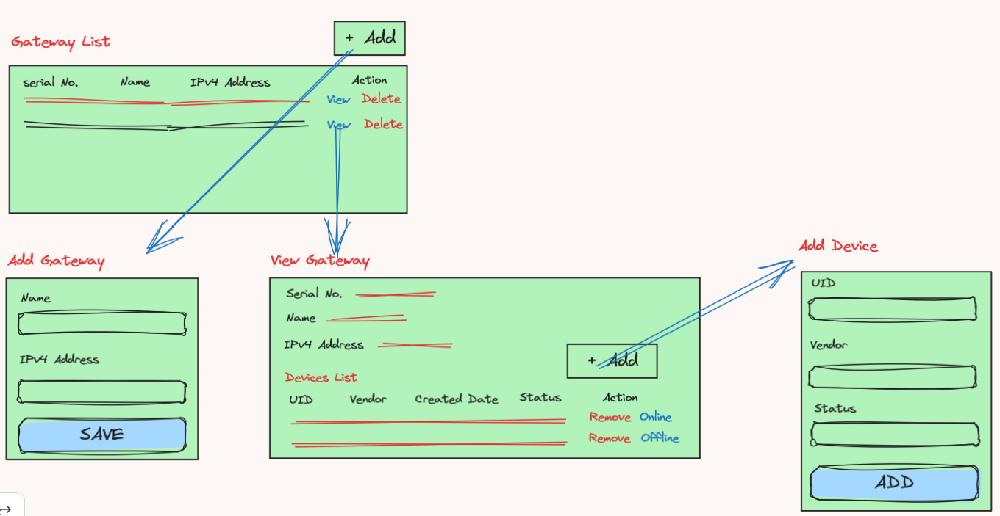

# Gateways
This sample project is managing gateways - master devices that control peripheral devices.
## Requirement
Your task is to create a REST service (JSON/HTTP) for storing information about these gateways and their associated devices. 
This information must be stored in the database.
When storing a gateway, any field marked as "to be validated" must be validated and an error returned if it is invalid.
Also, no more than 10 peripheral devices are allowed for a gateway.
The service must also offer an operating for displaying information about all stored gateways ( and their devices) and an operation
for displaying details for a single gateway. Finally, it must be possible to add and remove a device from a gateway.

Each gateway has:
- a unique serial number (string),
- human-readable name (string),
- IPv4 address (to be validated),
- multiple associated peripheral devices.

Each peripheral device has: 
- a UID (number),
- vendor (string),
- date created
- status - online/offline

## Low-Fi UI/UX

## Software Details
- Programming Language: Java 8
- Framework: Spring Boot
- Database: h2 (in-memory)
- Automated Build: Apache Maven

## Software Features
- Fetch all gateways
- Create one gateway
- Fetch all devices for gateway
- Add one device for gateway
- Remove one device for gateway

## Technical Features
- Spring Boot REST Controller
- MapStruct for Object Mapping
- Exception Handling
- Repository Design Pattern
- Hibernate
- Swagger Documentation
- Application Properties value implementation
- Validation
- Logging
- Unit Test
- CI/CD